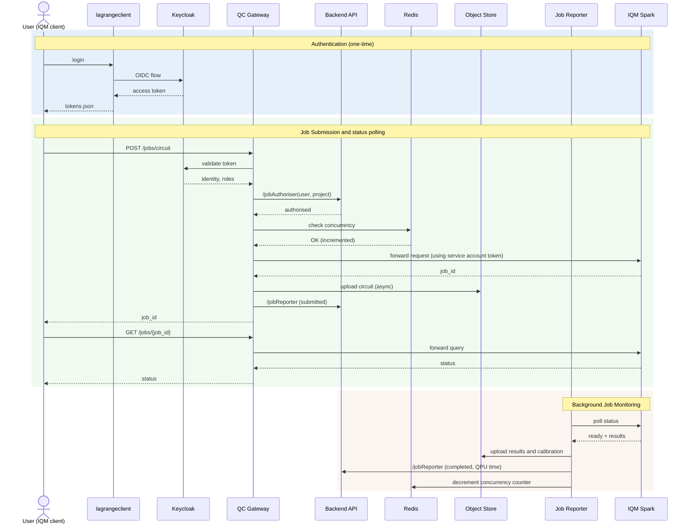

# Quantum Computer Middleware Proxy Documentation

This document provides an overview of the Middleware Proxy application, its structure, flow, plugin architecture, and modular components.

## Table of Contents
1. [Application Overview](#application-overview)
2. [Plugin Architecture](#plugin-architecture)
3. [Structure](#structure)
4. [Flow](#flow)
5. [Configuration](#configuration)
6. [Extending with New Plugins](#extending-with-new-plugins)
7. [Usage Examples](#usage-examples)

## Application Overview

The Middleware Proxy is a FastAPI-based application that acts as a reverse proxy for a quantum computer server. It handles authentication, authorization, concurrency limiting, job logging, and metrics collection. The application is designed to be resilient, modular, and defensive, ensuring that non-critical failures do not block the proxying of requests.

The proxy is **vendor-agnostic** and **site-agnostic** by design. All vendor-specific logic (e.g., how to parse IQM API responses) and site-specific logic (e.g., how to authorize jobs against a SPARK portal) are isolated in plugins that implement well-defined interfaces.

The proxy is also **transparent to client SDKs**. It preserves the upstream vendor API on the wire — URL paths, request and response bodies, status codes, and headers are passed through unchanged. Existing vendor clients (for example `iqm-client` or `cortex-cli` for IQM) work without code changes: the only adjustment needed is to point the client at the gateway's URL instead of the backend and to authenticate with a standard OIDC bearer token. There is no wrapper SDK to adopt, no API translation layer to maintain, and no divergence to track between what the gateway exposes and what the underlying vendor API offers. The vendor plugin is precisely the abstraction that makes this possible: it parses requests for the gateway's internal bookkeeping (shots, circuits, project, job type) while leaving the request body itself untouched as it flows to the upstream.

## Plugin Architecture

The proxy uses two plugin types to decouple vendor and site specifics from the generic middleware core:

### Vendor Plugin (`VendorPlugin` protocol)

A vendor plugin encapsulates everything specific to a quantum computer vendor's API:

- **Route definitions**: which API paths exist, which roles they require, which are logged
- **Request parsing**: extracting shots, circuits, project name, and job type from submission payloads
- **Response parsing**: extracting job IDs and artifact types from upstream responses
- **Header building**: injecting vendor-specific authentication into upstream requests
- **Job status polling**: querying the vendor API for job status, timeline, and artifacts
- **Artifact classification**: determining which artifacts to fetch based on terminal status
- **Calibration handling**: vendor-specific calibration run polling and report uploading

Currently available: **IQM** (`middleware/vendors/iqm/`)

### Site Plugin (`SitePlugin` protocol)

A site plugin encapsulates how a specific deployment site handles authorization and reporting:

- **Job authorization**: checking whether a user is allowed to submit a job (e.g., via a portal API, SLURM accounting, or billing system)
- **Job reporting**: sending job status reports and results to the site's tracking system
- **Results URL construction**: building user-facing URLs for job results

Currently available: **SPARK** (`middleware/sites/spark/`)

### Plugin Selection

Plugins are selected via environment variables:

```
VENDOR_PLUGIN=iqm      # default
SITE_PLUGIN=spark      # default
```

The plugin loader (`middleware/plugins/loader.py`) resolves plugin names to classes via a simple registry and instantiates them at application startup.

## Structure

The application is organized into a generic core, a plugin infrastructure layer, and vendor/site plugin implementations.

### Core Modules
- **`middleware/main.py`**: The main entry point. Implements the FastAPI application and the primary middleware logic. Loads vendor and site plugins at startup and delegates to them throughout the request flow.
- **`middleware/config.py`**: Core configuration settings (authentication, upstream URL, Redis, MinIO, concurrency limits, plugin selectors). Vendor/site-specific settings live in their respective plugin config modules.
- **`middleware/authorization.py`**: Generic role-based access control (`RoleAuthorizationChecker`). Initialized with route definitions from the vendor plugin.
- **`middleware/authentication.py`**: User authentication using JWT tokens (Keycloak).
- **`middleware/concurrency.py`**: Per-user concurrency limits using Redis counters (`ConcurrencyLimiter`).
- **`middleware/db.py`**: Database initialization and job logging (PostgreSQL).
- **`middleware/minio.py`**: S3-compatible object storage interface (`S3Uploader`).
- **`middleware/job_capture.py`**: Helper for uploading submitted payloads to MinIO.
- **`middleware/job_counters.py`**: Redis-based counters for tracking active jobs and Prometheus metrics.
- **`middleware/artifacts.py`**: Generic artifact upload helpers (timeline, artifacts, HTML index).
- **`middleware/reporting.py`**: Generic `JobReporter` (async) and `SyncJobReporter` (sync) base implementations.
- **`middleware/job_reporter.py`**: Background worker for job reconciliation. Uses vendor plugin for status fetching and artifact handling, and site plugin for reporting.

### Plugin Infrastructure
- **`middleware/plugins/interfaces.py`**: `VendorPlugin` and `SitePlugin` Protocol definitions.
- **`middleware/plugins/datatypes.py`**: Shared dataclasses exchanged between core and plugins (`RoutesConfig`, `JobSubmission`, `SubmissionResult`, `JobStatusResult`, `ArtifactClassification`, `JobAuthorizationResult`, `JobReportResult`).
- **`middleware/plugins/loader.py`**: Plugin registry and loading mechanism.

### IQM Vendor Plugin (`middleware/vendors/iqm/`)
- **`plugin.py`**: `IQMVendorPlugin` — facade implementing `VendorPlugin`, delegates to submodules.
- **`request_parser.py`**: Extracts shots, circuits, project, and job type from IQM submission payloads.
- **`response_parser.py`**: Extracts job IDs and artifact types from IQM upstream responses.
- **`headers.py`**: Builds upstream headers with `IQM_SERVER_TOKEN` injection.
- **`job_status.py`**: Fetches job status from the IQM `/api/v1/jobs/{id}` endpoint.
- **`calibration.py`**: Calibration run polling and artifact enrichment.
- **`config.py`**: IQM-specific settings and default route definitions (`ROLE_ROUTES`, `LOGGED_ROUTES`, `DEPRECATED_ROUTES`, `PUBLIC_ROUTES`).

### SPARK Site Plugin (`middleware/sites/spark/`)
- **`plugin.py`**: `SparkSitePlugin` — facade implementing `SitePlugin`, delegates to submodules.
- **`authorization.py`**: Job authorization via the SPARK portal's `/jobAuthorizer` endpoint.
- **`reporting.py`**: Job reporting via the SPARK portal's `/jobReport` endpoint (PUT-first, POST-fallback).
- **`config.py`**: SPARK-specific settings (`PORTAL_API_HOST`, `BASE_DOMAIN`).

## Flow

### Sequence Diagram (for IQM Vendor + SPARK Site reference plugins)

The diagram below illustrates the full request and background-job flow using the two reference plugins (IQM as the vendor, SPARK as the site). It covers authentication, job submission with authorization and concurrency checks, and background job reconciliation.



This diagram shows the three main phases:

1. **Authentication** (blue): User obtains an OIDC token from Keycloak once.
2. **Job Submission & Polling** (green): User submits a job (POST) with JWT auth, triggering authorization, concurrency checks, and upstream proxying. User polls for status (GET) as needed.
3. **Background Monitoring** (orange): The Job Reporter worker continuously reconciles job state by polling the backend, uploading artifacts, reporting completion, and decrementing concurrency counters. Calibration polling (IQM-specific) runs in parallel.

### Request Flow Steps

The flow of the application can be broken down into the following steps:

### 1. Initialization (`lifespan` context manager)
- The `lifespan` function in `main.py` initializes shared resources:
  - Loads the **vendor plugin** and **site plugin** based on `VENDOR_PLUGIN` / `SITE_PLUGIN` env vars.
  - Retrieves **route definitions** from the vendor plugin (`get_routes_config()`).
  - Initializes `RoleAuthorizationChecker` with the vendor-provided routes.
  - Creates `http_client`, `redis` client, `concurrency_limiter`, and starts background metrics worker.

### 2. Request Handling (`proxy_and_capture` middleware)

1. **Skip Public Routes**: Public routes (from vendor plugin's `RoutesConfig`) bypass authentication.

2. **Deprecated Routes**: Requests to deprecated routes (from vendor plugin) return `410 Gone`.

3. **Maintenance Mode**: If in maintenance mode, all requests are blocked with `503`.

4. **Route Whitelist Check**: `RoleAuthorizationChecker.is_route_configured()` checks if the path/method exist in the vendor-provided `ROLE_ROUTES`. Unconfigured routes get `403`.

5. **Authentication**: `get_current_user` validates the JWT token and extracts user information.

6. **Role-Based Access Control**: `RoleAuthorizationChecker.check()` verifies the user has the required role.

7. **Submission Parsing**: The **vendor plugin**'s `parse_submission_request()` extracts shots, circuits, project, and job type from the request body.

8. **Job Authorization** (production mode): The **site plugin**'s `authorize_job()` checks if the user is allowed to submit. Denied requests get `403`.

9. **Concurrency Limiting** (production mode): `ConcurrencyLimiter` checks per-user limits. Exceeded limits return `429`.

10. **Proxy to Upstream**: The request is proxied with headers built by the **vendor plugin**'s `build_upstream_headers()`.

11. **Response Parsing**: The **vendor plugin**'s `parse_submission_response()` extracts the job ID and artifact types from the upstream response.

12. **Job Logging and Reporting** (on success): The submitted payload is uploaded to MinIO, the job is logged in PostgreSQL, and an initial report is sent via the **site plugin**'s `send_initial_report()`.

13. **Rollback on Failure**: Concurrency counters are rolled back if the upstream request fails.

### 3. Background Tasks

- **Metrics Worker**: Periodically updates Prometheus metrics from Redis counters.

- **Job Reporter** (`job_reporter.py`): Continuously polls for pending jobs:
  - Fetches authoritative status via the **vendor plugin**'s `get_job_status()`.
  - Classifies artifacts via the **vendor plugin**'s `classify_artifacts()`.
  - Uploads artifacts and timeline to MinIO.
  - Builds results URL via the **site plugin**'s `build_results_url()`.
  - Sends final reports via the **site plugin**'s `report_job_sync()`.
  - Decrements Redis counters idempotently.
  - Runs vendor-specific calibration polling via the **vendor plugin**'s `process_calibration_runs()`.

## Configuration

The application is configured using environment variables via Pydantic Settings.

### Core Settings (`middleware/config.py`)
- **Plugin selection**: `VENDOR_PLUGIN`, `SITE_PLUGIN`
- **Operational modes**: `production`, `authentication`, `reporting`, `maintenance`
- **Authentication**: `KEYCLOAK_ISSUER`, `KEYCLOAK_JWKS_URL`, `AUDIENCE`
- **Upstream**: `MACHINE_URL`, `UPSTREAM_TIMEOUT`, `VERIFY_UPSTREAM_SSL`
- **CORS**: `FRONTEND_URL` (public-facing frontend URL; used to whitelist the CORS origin)
- **MinIO/S3**: `MINIO_SERVER_URL`, `BUCKET_NAME`, `APP_USER`, `APP_PASSWORD`
- **Redis**: `REDIS_HOST`, `REDIS_PORT`, `REDIS_DB`, `REDIS_PASSWORD`
- **Concurrency**: `MAX_CONCURRENT_SHOTS`, `MAX_CONCURRENT_SWEEPS`
- **Job reporter**: `JOB_REPORTER_INTERVAL`, `JOB_REPORTER_HTTP_TIMEOUT`, etc.

### IQM Vendor Settings (`middleware/vendors/iqm/config.py`)
- `IQM_SERVER_TOKEN`: Token for authenticating with the IQM server
- `CALIBRATION_POLL_INTERVAL`: Interval for calibration polling
- Default route definitions (`ROLE_ROUTES`, `LOGGED_ROUTES`, `DEPRECATED_ROUTES`, `PUBLIC_ROUTES`)

### SPARK Site Settings (`middleware/sites/spark/config.py`)
- `PORTAL_API_HOST`: Internal URL of the SPARK portal API (used by the site plugin for authorization/reporting calls)
- `BASE_DOMAIN`: Base domain for constructing results URLs

## Extending with New Plugins

### Adding a New Vendor Plugin

1. Create a directory `middleware/vendors/<name>/` with `__init__.py` and `plugin.py`.
2. Implement a class that satisfies the `VendorPlugin` protocol (see `middleware/plugins/interfaces.py`).
3. Register it in `middleware/plugins/loader.py`:
   ```python
   _VENDOR_REGISTRY["myvendor"] = "middleware.vendors.myvendor.plugin.MyVendorPlugin"
   ```
4. Set `VENDOR_PLUGIN=myvendor` in the environment.

At minimum, the plugin must implement:
- `get_routes_config()` — define which API routes exist and their role requirements
- `parse_submission_request()` — extract job metadata from the request body
- `parse_submission_response()` — extract job ID from the upstream response
- `build_upstream_headers()` — inject authentication for the upstream server
- `get_terminal_statuses()` — define which statuses mean "job is done"
- `get_job_status()` — query the upstream server for job status
- `get_artifact_url()` / `get_payload_url()` — URL patterns for fetching artifacts
- `classify_artifacts()` — which artifacts to fetch per terminal status
- `get_health_endpoint()` — the vendor's health check path

### Adding a New Site Plugin

1. Create a directory `middleware/sites/<name>/` with `__init__.py` and `plugin.py`.
2. Implement a class that satisfies the `SitePlugin` protocol (see `middleware/plugins/interfaces.py`).
3. Register it in `middleware/plugins/loader.py`:
   ```python
   _SITE_REGISTRY["mysite"] = "middleware.sites.mysite.plugin.MySitePlugin"
   ```
4. Set `SITE_PLUGIN=mysite` in the environment.

At minimum, the plugin must implement:
- `authorize_job()` — check whether a user can submit a job
- `report_job_async()` / `report_job_sync()` — send job reports
- `send_initial_report()` — send the initial submission report
- `build_results_url()` — construct the user-facing results URL

## Usage Examples

### 1. Running the Application (handled by the Docker container)

```bash
uvicorn middleware.main:app --host 0.0.0.0 --port 8000
```

### 2. Running with Custom Plugins

```bash
VENDOR_PLUGIN=iqm SITE_PLUGIN=spark uvicorn middleware.main:app --host 0.0.0.0 --port 8000
```

### 3. Using Modular Components

The modular components can be used independently. For usage examples, integration patterns, and best practices, refer to [MODULARIZATION.md](MODULARIZATION.md).
