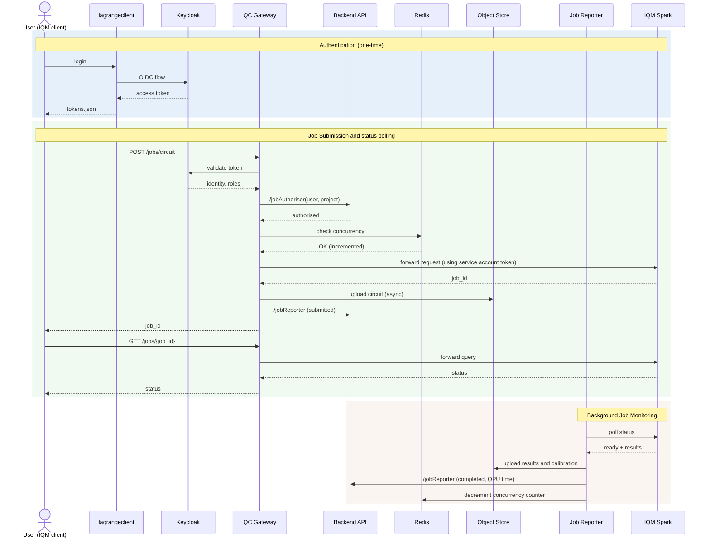

# Quantum Computer Middleware Proxy Documentation

This document provides an overview of the Middleware Proxy application, its structure, flow, plugin architecture, and modular components.

## Table of Contents
1. [Application Overview](#application-overview)
2. [Plugin Architecture](#plugin-architecture)
3. [Structure](#structure)
4. [Flow](#flow)
5. [Configuration](#configuration)
6. [Extending with New Plugins](#extending-with-new-plugins)
7. [Usage Examples](#usage-examples)

## Application Overview

The Middleware Proxy is a FastAPI-based application that acts as a reverse proxy for a quantum computer server. It handles authentication, authorization, submission policy, job logging, and metrics collection. The application is designed to be resilient, modular, and defensive, ensuring that non-critical failures do not block the proxying of requests.

The proxy is **vendor-agnostic** and **site-agnostic** by design. All vendor-specific logic (e.g., how to parse IQM API responses) and site-specific logic (e.g., how to authorize jobs against a SPARK portal) are isolated in plugins that implement well-defined interfaces.

The proxy is also **transparent to client SDKs**. It preserves the upstream vendor API on the wire — URL paths, request and response bodies, status codes, and headers are passed through unchanged. Existing vendor clients (for example `iqm-client` or `cortex-cli` for IQM) work without code changes: the only adjustment needed is to point the client at the gateway's URL instead of the backend and to authenticate with a standard OIDC bearer token. There is no wrapper SDK to adopt, no API translation layer to maintain, and no divergence to track between what the gateway exposes and what the underlying vendor API offers. The vendor plugin is precisely the abstraction that makes this possible: it parses requests for the gateway's internal bookkeeping (shots, circuits, project, job type) while leaving the request body itself untouched as it flows to the upstream.

## Plugin Architecture

The proxy uses four plugin types to decouple credential formats, deployment policy, and vendor and site specifics from the generic middleware core:

### Auth Plugin (`AuthPlugin` protocol)

Validates the bearer token and produces a `Principal` — the authenticated
identity the rest of the request flow carries. Plugins are configured as an
ordered chain in `AUTH_PLUGINS`.

- `keycloak` (default): RS256 JWTs verified against the realm's JWKS, roles
  from `realm_access.roles`. Claims no token prefix.
- `sqed`: per-job tokens minted by a SLURM SPANK plugin onto a Redis bus, for
  deployments where submissions arrive from the scheduler rather than from a
  person. Claims the `sqed_` prefix.

A prefixed token is routed to its owning plugin alone; anything else is tried
against the prefix-less plugins in order. Adding a prefixed plugin therefore
cannot change how an existing JWT is handled. See
[MODULARIZATION.md](MODULARIZATION.md) for the full contract.

### Policy Plugin (`PolicyPlugin` protocol)

Decides whether a submission may proceed — quota, budget, concurrency —
selected with `POLICY_PLUGIN`.

- `passthrough` (default): the flat `MAX_CONCURRENT_SHOTS` /
  `MAX_CONCURRENT_SWEEPS` per-user limits, unchanged from before policy was
  pluggable.
- `shot_budget`: a concurrent-shot budget derived from the licenses a batch
  scheduler reserved for the job. Sweeps keep the flat sweep limit.

Capacity is reserved before the request is proxied and released if the machine
refuses it, so the protocol has three calls rather than one. See
[MODULARIZATION.md](MODULARIZATION.md).

### Vendor Plugin (`VendorPlugin` protocol)

A vendor plugin encapsulates everything specific to a quantum computer vendor's API:

- **Route definitions**: which API paths exist, which roles they require, which are logged
- **Request parsing**: extracting shots, circuits, project name, and job type from submission payloads
- **Response parsing**: extracting job IDs and artifact types from upstream responses
- **Header building**: injecting vendor-specific authentication into upstream requests
- **Job status polling**: querying the vendor API for job status, timeline, and artifacts
- **Artifact classification**: determining which artifacts to fetch based on terminal status
- **Calibration handling**: vendor-specific calibration run polling and report uploading

Currently available: **IQM** (`middleware/vendors/iqm/`)

### Site Plugin (`SitePlugin` protocol)

A site plugin encapsulates how a specific deployment site handles authorization and reporting:

- **Job authorization**: checking whether a user is allowed to submit a job (e.g., via a portal API, SLURM accounting, or billing system)
- **Job reporting**: sending job status reports and results to the site's tracking system
- **Results URL construction**: building user-facing URLs for job results

Currently available: **SPARK** (`middleware/sites/spark/`)

### Plugin Selection

Plugins are selected via environment variables:

```
VENDOR_PLUGIN=iqm      # default
SITE_PLUGIN=spark      # default
```

The plugin loader (`middleware/plugins/loader.py`) resolves plugin names to classes via a simple registry and instantiates them at application startup.

Authentication is selected the same way, except that it is a *list* rather
than one choice:

```bash
AUTH_PLUGINS=keycloak        # default — OIDC only
AUTH_PLUGINS=keycloak,sqed   # OIDC, plus scheduler-minted tokens
STRICT_PREFIX_MODE=false     # true rejects any token without a plugin prefix
```

```bash
POLICY_PLUGIN=passthrough    # default — flat per-user concurrency limits
POLICY_PLUGIN=shot_budget    # license-derived concurrent-shot budget
```

## Structure

The application is organized into a generic core, a plugin infrastructure layer, and vendor/site plugin implementations.

### Core Modules
- **`middleware/main.py`**: The main entry point. Implements the FastAPI application and the primary middleware logic. Loads the vendor, site, auth and policy plugins at startup and delegates to them throughout the request flow.
- **`middleware/config.py`**: Core configuration settings (authentication, upstream URL, Redis, MinIO, concurrency limits, plugin selectors). Vendor/site-specific settings live in their respective plugin config modules.
- **`middleware/authorization.py`**: Generic role-based access control (`RoleAuthorizationChecker`). Initialized with route definitions from the vendor plugin.
- **`middleware/authentication.py`**: Bearer-token authentication (`authenticate()`), which routes a token through the configured auth plugin chain rather than validating it here — nothing in this module knows what a JWT is.
- **`middleware/auth/`**: The auth backends. `keycloak.py` (`KeycloakAuthPlugin`, OIDC JWTs verified against the realm's JWKS) and `sqed.py` (`SqedAuthPlugin`, per-job tokens a SLURM SPANK plugin puts on the Redis bus), with `sqed_config.py` for the latter's settings.
- **`middleware/concurrency.py`**: Per-user concurrency limits using Redis counters (`ConcurrencyLimiter`). Reached through the policy plugin, which owns the submission-time decision; the limiter itself only counts.
- **`middleware/policy/`**: The submission-policy backends. `passthrough.py` (`PassthroughPolicyPlugin`, the flat per-user limits this gateway has always applied) and `shot_budget.py` (`ShotBudgetPolicyPlugin`, a concurrent-shot budget derived from the licenses a batch scheduler reserved), with `shot_budget_config.py` for the latter's settings.
- **`middleware/db.py`**: Database initialization and job logging (PostgreSQL).
- **`middleware/minio.py`**: S3-compatible object storage interface (`S3Uploader`).
- **`middleware/job_capture.py`**: Helper for uploading submitted payloads to MinIO.
- **`middleware/job_counters.py`**: Redis-based counters for tracking active jobs and Prometheus metrics.
- **`middleware/artifacts.py`**: Generic artifact upload helpers (timeline, artifacts, HTML index). Artifacts are stored as the bytes the machine returned; where the vendor plugin can decode one, the decoded view is written beside it as `<type>.parsed.json` (`upload_parsed_artifact`), so a viewer needs no vendor parser.
- **`middleware/reporting.py`**: Generic `JobReporter` (async) and `SyncJobReporter` (sync) base implementations.
- **`middleware/job_reporter.py`**: Background worker for job reconciliation. Uses vendor plugin for status fetching and artifact handling, and site plugin for reporting.

### Plugin Infrastructure
- **`middleware/plugins/interfaces.py`**: The `AuthPlugin`, `PolicyPlugin`, `VendorPlugin` and `SitePlugin` Protocol definitions, plus the `AuthError` a plugin raises for a token it claimed and could not verify.
- **`middleware/plugins/datatypes.py`**: Shared dataclasses exchanged between core and plugins (`Principal`, `PolicyDecision`, `RoutesConfig`, `JobSubmission`, `SubmissionResult`, `JobStatusResult`, `ArtifactClassification`, `JobAuthorizationResult`, `JobReportResult`).
- **`middleware/plugins/loader.py`**: Plugin registry and loading mechanism.

### IQM Vendor Plugin (`middleware/vendors/iqm/`)
- **`plugin.py`**: `IQMVendorPlugin` — facade implementing `VendorPlugin`, delegates to submodules.
- **`request_parser.py`**: Extracts shots, circuits, project, and job type from IQM submission payloads.
- **`response_parser.py`**: Extracts job IDs and artifact types from IQM upstream responses.
- **`headers.py`**: Builds upstream headers with `IQM_SERVER_TOKEN` injection.
- **`job_status.py`**: Fetches job status from the IQM `/api/v1/jobs/{id}` endpoint.
- **`sweep_parser.py`**: Decodes IQM's protobuf sweep artifacts into a display-sized JSON view, using IQM's own `iqm-data-definitions` package. Traces and 2-D fields are decimated to fixed budgets so the sidecar stays small whatever the sweep's size.
- **`jobs-portal/`**: The static viewer served for a job's results URL. Reads the parsed sidecars over HTTP and renders them; it carries no vendor parser of its own.
- **`calibration.py`**: Calibration run polling and artifact enrichment.
- **`config.py`**: IQM-specific settings and default route definitions (`ROLE_ROUTES`, `LOGGED_ROUTES`, `DEPRECATED_ROUTES`, `PUBLIC_ROUTES`).

### SPARK Site Plugin (`middleware/sites/spark/`)
- **`plugin.py`**: `SparkSitePlugin` — facade implementing `SitePlugin`, delegates to submodules.
- **`authorization.py`**: Job authorization via the SPARK portal's `/jobAuthorizer` endpoint.
- **`reporting.py`**: Job reporting via the SPARK portal's `/jobReport` endpoint (PUT-first, POST-fallback).
- **`config.py`**: SPARK-specific settings (`PORTAL_API_HOST`, `BASE_DOMAIN`).

## Flow

### Sequence Diagram (for IQM Vendor + SPARK Site reference plugins)

The diagram below illustrates the full request and background-job flow using the two reference plugins (IQM as the vendor, SPARK as the site). It covers authentication, job submission with authorization and concurrency checks, and background job reconciliation.


```mermaid
sequenceDiagram
    actor User as User (IQM client)
    participant CLI as lagrangeclient
    participant KC as Keycloak
    participant QC_GW as QC Gateway
    participant API as Backend API
    participant Redis as Redis
    participant S3 as Object Store
    participant JR as Job Reporter
    participant IQM as IQM Spark

    rect rgb(230, 240, 250)
    note over User,IQM: Authentication (one-time)
    User->>CLI: login
    CLI->>KC: OIDC flow
    KC-->>CLI: access token
    CLI-->>User: tokens.json
    end

    rect rgb(240, 250, 240)
    note over User,IQM: Job Submission and status polling
    User->>QC_GW: POST /jobs/circuit
    QC_GW->>KC: validate token
    KC-->>QC_GW: identity, roles
    QC_GW->>API: /jobAuthoriser(user, project)
    API-->>QC_GW: authorised
    QC_GW->>Redis: check concurrency
    Redis-->>QC_GW: OK (incremented)
    QC_GW->>IQM: forward request (using service account token)
    IQM-->>QC_GW: job_id
    QC_GW->>S3: upload circuit (async)
    QC_GW->>API: /jobReporter (submitted)
    QC_GW-->>User: job_id
    
    User->>QC_GW: GET /jobs/{job_id}
    QC_GW->>IQM: forward query
    IQM-->>QC_GW: status
    QC_GW-->>User: status
    end

    rect rgb(250, 245, 240)
    note over JR,IQM: Background Job Monitoring
    JR->>IQM: poll status
    IQM-->>JR: ready + results
    JR->>S3: upload results and calibration
    JR->>API: /jobReporter (completed, QPU time)
    JR->>Redis: decrement concurrency counter
    end
```

This diagram shows the three main phases:

1. **Authentication** (blue): User obtains an OIDC token from Keycloak once.
2. **Job Submission & Polling** (green): User submits a job (POST) with JWT auth, triggering authorization, concurrency checks, and upstream proxying. User polls for status (GET) as needed.
3. **Background Monitoring** (orange): The Job Reporter worker continuously reconciles job state by polling the backend, uploading artifacts, reporting completion, and decrementing concurrency counters. Calibration polling (IQM-specific) runs in parallel.

### Request Flow Steps

The flow of the application can be broken down into the following steps:

### 1. Initialization (`lifespan` context manager)
- The `lifespan` function in `main.py` initializes shared resources:
  - Loads the **vendor plugin** and **site plugin** from `VENDOR_PLUGIN` / `SITE_PLUGIN`, and the **policy plugin** from `POLICY_PLUGIN`.
  - Retrieves **route definitions** from the vendor plugin (`get_routes_config()`).
  - Initializes `RoleAuthorizationChecker` with the vendor-provided routes.
  - Creates `http_client`, `redis` client and `concurrency_limiter`, and starts the background metrics worker.
  - Loads the **auth plugin chain** from `AUTH_PLUGINS`, *after* Redis: a plugin whose tokens live on the bus gets a live client in its constructor instead of retrying later.

### 2. Request Handling (`proxy_and_capture` middleware)

1. **Skip Public Routes**: Public routes (from vendor plugin's `RoutesConfig`) bypass authentication.

2. **Deprecated Routes**: Requests to deprecated routes (from vendor plugin) return `410 Gone`.

3. **Maintenance Mode**: If in maintenance mode, all requests are blocked with `503`.

4. **Route Whitelist Check**: `RoleAuthorizationChecker.is_route_configured()` checks if the path/method exist in the vendor-provided `ROLE_ROUTES`. Unconfigured routes get `403`.

5. **Authentication**: `authenticate()` routes the bearer token through the configured chain (`AUTH_PLUGINS`). A token matching a plugin's declared prefix (e.g. `sqed_`) goes to that plugin alone — a prefix is a hard claim, with no fallback — and anything else is offered to the prefix-less plugins in order, the first `Principal` winning. The `Principal` carries the identity, the roles and an auth-source-specific metadata bag.

6. **Role-Based Access Control**: `RoleAuthorizationChecker.check()` verifies the principal has the required role.

7. **Submission Parsing**: The **vendor plugin**'s `parse_submission_request()` extracts shots, circuits, project, and job type from the request body.

8. **Job Authorization** (production mode): The **site plugin**'s `authorize_job()` checks if the user is allowed to submit. Denied requests get `403`.

9. **Submission Policy** (production mode): the **policy plugin**'s `check_submission()` decides whether the submission may proceed, and reserves whatever capacity it grants. `passthrough` (the default) applies the flat per-user `ConcurrencyLimiter` limits; `shot_budget` derives a per-principal ceiling of `min(n_licenses × SHOTS_PER_LICENSE, MAX_CONCURRENT_SHOTS)` from the licenses named in the token — a principal whose token names none falls back to the flat `MAX_CONCURRENT_SHOTS`, and sweeps keep the flat sweep limit either way. A denied submission returns the decision's own status code — `429` for quota.

10. **Proxy to Upstream**: The request is proxied with headers built by the **vendor plugin**'s `build_upstream_headers()`.

11. **Response Parsing**: The **vendor plugin**'s `parse_submission_response()` extracts the job ID and artifact types from the upstream response.

12. **Job Logging and Reporting** (on success): The policy plugin's `on_submission_accepted()` commits the reservation against the real job id. The submitted payload is uploaded to MinIO, the job is logged in PostgreSQL, and an initial report is sent via the **site plugin**'s `send_initial_report()`.

13. **Rollback on Failure**: the policy plugin's `rollback()` gives back what step 9 reserved, whether the machine refused the submission or the call never reached it.

### 3. Background Tasks

- **Metrics Worker**: Periodically updates Prometheus metrics from Redis counters.

- **Job Reporter** (`job_reporter.py`): Continuously polls for pending jobs:
  - Fetches authoritative status via the **vendor plugin**'s `get_job_status()`.
  - Classifies artifacts via the **vendor plugin**'s `classify_artifacts()`.
  - Uploads artifacts and timeline to MinIO, verbatim, plus a `<type>.parsed.json` sidecar wherever the vendor plugin's `parse_artifact()` can decode one.
  - Builds results URL via the **site plugin**'s `build_results_url()`.
  - Sends final reports via the **site plugin**'s `report_job_sync()`.
  - Decrements Redis counters idempotently.

- **Calibration Poller** (`calibration_poller.py`): a separate container from the same image. Every `CALIBRATION_POLL_INTERVAL` it calls the **vendor plugin**'s `process_calibration_runs()` with the headers from `build_calibration_headers()`. It used to be a branch in the Job Reporter's loop, and was split out when the machine began requiring an administrator token for its calibration endpoints: that token is held by this container alone, never by the one that reports jobs, and the two cadences — seconds and an hour — no longer share a loop. A credential the machine refuses is logged once when it starts and once when it recovers, not on every poll.
  - For IQM, each poll uploads new reports to `calibration/<calibration_set_id>_report.zip` — the path job pages already link to — and rewrites `calibration/index.json` and `calibration/index.html`: every stored report, grouped by day in the deployment's `TZ`, newest first. Reports fetched before the index existed are dated from the machine's run listing on the next poll; one the machine no longer lists is placed by the time it was fetched, and marked approximate.

## Configuration

The application is configured using environment variables via Pydantic Settings.

### Core Settings (`middleware/config.py`)
- **Plugin selection**: `VENDOR_PLUGIN`, `SITE_PLUGIN`, `AUTH_PLUGINS`, `POLICY_PLUGIN`
- **Operational modes**: `production`, `authentication`, `reporting`, `maintenance`
- **Authentication**: `KEYCLOAK_ISSUER`, `KEYCLOAK_JWKS_URL`, `AUDIENCE`; `STRICT_PREFIX_MODE` to reject any token that carries no plugin prefix
- **Upstream**: `MACHINE_URL`, `UPSTREAM_TIMEOUT`, `VERIFY_UPSTREAM_SSL`
- **CORS**: `FRONTEND_URL` (public-facing frontend URL; used to whitelist the CORS origin)
- **Object store (S3)**: `MINIO_SERVER_URL`, `BUCKET_NAME`, `APP_USER`, `APP_PASSWORD` — any S3-compatible store; the variable names predate the move off MinIO and are kept. Optional `S3_ENDPOINT_URL` is where the S3 client itself connects, when that should not be the public URL links carry (e.g. `http://rustfs:9000` on the compose network)
- **Redis**: `REDIS_HOST`, `REDIS_PORT`, `REDIS_DB`, `REDIS_PASSWORD`
- **Concurrency**: `MAX_CONCURRENT_SHOTS`, `MAX_CONCURRENT_SWEEPS`
- **Job reporter**: `JOB_REPORTER_INTERVAL`, `JOB_REPORTER_HTTP_TIMEOUT`, etc.

### Object store (reference deployment)

`docker-compose.yaml` runs **RustFS** (`rustfs`, pinned by digest) as the
object store, on the ports MinIO used (`127.0.0.1:9000` S3, `:9001` console),
so the reverse proxy in front of it and every stored link are unchanged. It
reads `MINIO_ROOT_USER`/`MINIO_ROOT_PASSWORD` as its root credentials and keeps
its data in `${MINIO_STORAGE_PATH}/rustfs`. `rustfs-init` (built from
`rustfs-init/`, using the pinned RustFS CLI `rc`) creates the bucket and the
application user and sets the anonymous policy — `s3:GetObject` only, never
`s3:ListBucket`, so an object is readable by its exact key and the bucket
cannot be listed — and a CORS rule allowing `GET`/`HEAD` from any origin, which
the job portal needs to fetch results from `store.*` (MinIO allowed this by
default; RustFS sends no CORS headers without a rule). It runs on every `up`
and is idempotent.

**After MinIO.** MinIO is no longer part of the stack. Deployments that ran it
migrated through the release that introduced RustFS, which served missing keys
from MinIO on demand and backfilled the rest (see CHANGELOG, "the object store
is RustFS"). `rustfs-init` finishes that migration: while RustFS
still points at MinIO it removes the pointer, but only if the backfill completed
with nothing failed; otherwise it exits non-zero and says so, leaving the
configuration in place. It also mounts `${MINIO_STORAGE_PATH}` read-only: a
MinIO bucket left in `${MINIO_STORAGE_PATH}/data` is reported as deletable when
the migration finished, and as an error when it never ran — that deployment's
objects are not being served until it goes through that release first.
Its exit code is the check, since nothing waits on it:

```bash
docker compose ps -a rustfs-init       # Exited (0)
docker compose logs rustfs-init
```

**Backups.** `restic` backs up `/data/rustfs`.

### Sqed Auth Plugin Settings (`middleware/auth/sqed_config.py`)
Read only when `sqed` is in `AUTH_PLUGINS`.
- `SQED_TOKEN_PREFIX`: the prefix this plugin claims (default `sqed_`)
- `SQED_DEFAULT_ROLES`: roles every scheduler-authenticated principal gets — the cluster vouches for the account, not for privileges
- `SQED_ROLES_LOOKUP_URL`, `SQED_ROLES_CACHE_TTL`, `SQED_ROLES_VERIFY_TLS`: optional per-user roles lookup on the portal backend, whose results are *added* to the defaults; a failure falls back to them

### Shot Budget Policy Settings (`middleware/policy/shot_budget_config.py`)
Read only when `POLICY_PLUGIN=shot_budget`.
- `SHOTS_PER_LICENSE`: concurrent active shots granted per held license

### IQM Vendor Settings (`middleware/vendors/iqm/config.py`)
- `IQM_SERVER_TOKEN`: Token for authenticating with the IQM server (job traffic)
- `ADMIN_IQM_TOKEN`: Administrator token for the calibration endpoints, which refuse the device token; read only by the calibration poller. Unset, calibration uses `IQM_SERVER_TOKEN`
- `CALIBRATION_POLL_INTERVAL`: Seconds between calibration polls
- Default route definitions (`ROLE_ROUTES`, `LOGGED_ROUTES`, `DEPRECATED_ROUTES`, `PUBLIC_ROUTES`)

### SPARK Site Settings (`middleware/sites/spark/config.py`)
- `PORTAL_API_HOST`: Internal URL of the SPARK portal API (used by the site plugin for authorization/reporting calls)
- `BASE_DOMAIN`: Base domain for constructing results URLs

## Extending with New Plugins

### Adding a New Vendor Plugin

1. Create a directory `middleware/vendors/<name>/` with `__init__.py` and `plugin.py`.
2. Implement a class that satisfies the `VendorPlugin` protocol (see `middleware/plugins/interfaces.py`).
3. Register it in `middleware/plugins/loader.py`:
   ```python
   _VENDOR_REGISTRY["myvendor"] = "middleware.vendors.myvendor.plugin.MyVendorPlugin"
   ```
4. Set `VENDOR_PLUGIN=myvendor` in the environment.

At minimum, the plugin must implement:
- `get_routes_config()` — define which API routes exist and their role requirements
- `parse_submission_request()` — extract job metadata from the request body
- `parse_submission_response()` — extract job ID from the upstream response
- `build_upstream_headers()` — inject authentication for the upstream server
- `get_terminal_statuses()` — define which statuses mean "job is done"
- `get_job_status()` — query the upstream server for job status
- `get_artifact_url()` / `get_payload_url()` — URL patterns for fetching artifacts
- `classify_artifacts()` — which artifacts to fetch per terminal status
- `parse_artifact()` — optionally decode a binary artifact into a JSON view; return `None` for anything the plugin does not decode, and never raise: the raw artifact is already stored by the time this is called
- `get_health_endpoint()` — the vendor's health check path

### Adding a New Site Plugin

1. Create a directory `middleware/sites/<name>/` with `__init__.py` and `plugin.py`.
2. Implement a class that satisfies the `SitePlugin` protocol (see `middleware/plugins/interfaces.py`).
3. Register it in `middleware/plugins/loader.py`:
   ```python
   _SITE_REGISTRY["mysite"] = "middleware.sites.mysite.plugin.MySitePlugin"
   ```
4. Set `SITE_PLUGIN=mysite` in the environment.

At minimum, the plugin must implement:
- `authorize_job()` — check whether a user can submit a job
- `report_job_async()` / `report_job_sync()` — send job reports
- `send_initial_report()` — send the initial submission report
- `build_results_url()` — construct the user-facing results URL

### Adding a New Auth Plugin

1. Create `middleware/auth/<name>.py`.
2. Implement a class that satisfies the `AuthPlugin` protocol (see `middleware/plugins/interfaces.py`).
3. Register it in `middleware/plugins/loader.py`:
   ```python
   _AUTH_REGISTRY["mytokens"] = "middleware.auth.mytokens.MyTokensAuthPlugin"
   ```
4. Add it to `AUTH_PLUGINS` in the environment. The value is an ordered list, so
   `AUTH_PLUGINS=keycloak,mytokens` keeps OIDC working exactly as before.

The plugin must implement:
- `name` — the identifier used in `AUTH_PLUGINS` and in log lines
- `prefixes()` — the token prefixes this plugin claims, or an empty list to join the fallback chain
- `validate()` — return a `Principal`, return `None` for "not my token", or raise `AuthError` for a token that is
  this plugin's and is bad

The distinction in the last point is the one to get right. Returning `None` keeps the chain going; raising stops it.
A token that announces its issuer through a prefix and then fails to verify must raise, or a specific failure
becomes a generic one.

### Adding a New Policy Plugin

1. Create `middleware/policy/<name>.py`.
2. Implement a class that satisfies the `PolicyPlugin` protocol (see `middleware/plugins/interfaces.py`).
3. Register it in `middleware/plugins/loader.py`:
   ```python
   _POLICY_REGISTRY["mypolicy"] = "middleware.policy.mypolicy.MyPolicyPlugin"
   ```
4. Set `POLICY_PLUGIN=mypolicy` in the environment.

The plugin must implement:
- `name` — the identifier used in `POLICY_PLUGIN` and in log lines
- `check_submission()` — decide, and reserve whatever the decision grants
- `on_submission_accepted()` — the commit point, once the machine has returned a job id
- `rollback()` — give the reservation back

Three calls rather than one because a reservation has to be undoable: capacity is taken before the request is
proxied, and the machine may still refuse it. Per-submission state belongs in the returned `PolicyDecision`'s
`reservation` bag, not on the plugin instance — two submissions are in flight at once whenever two clients are,
and instance state cannot tell them apart.

## Usage Examples

### 1. Running the Application (handled by the Docker container)

```bash
uvicorn middleware.main:app --host 0.0.0.0 --port 8000
```

### 2. Running with Custom Plugins

```bash
VENDOR_PLUGIN=iqm SITE_PLUGIN=spark uvicorn middleware.main:app --host 0.0.0.0 --port 8000
```

### 3. Using Modular Components

The modular components can be used independently. For usage examples, integration patterns, and best practices, refer to [MODULARIZATION.md](MODULARIZATION.md).
